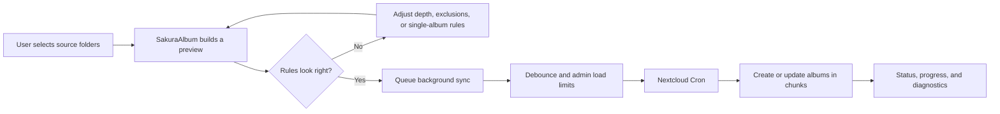
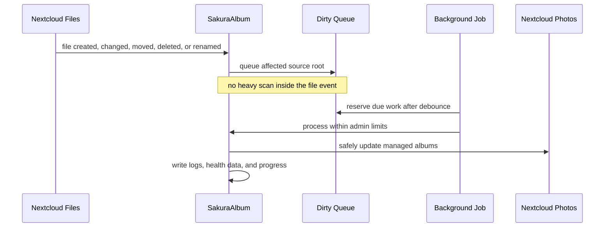
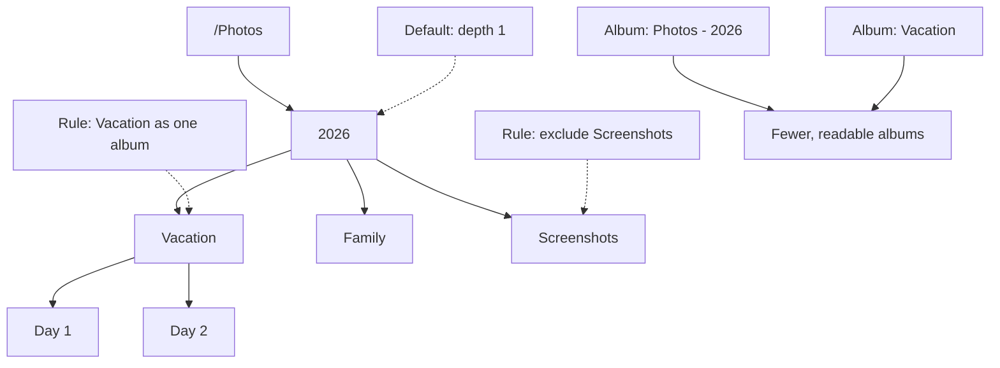
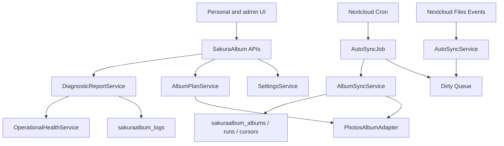
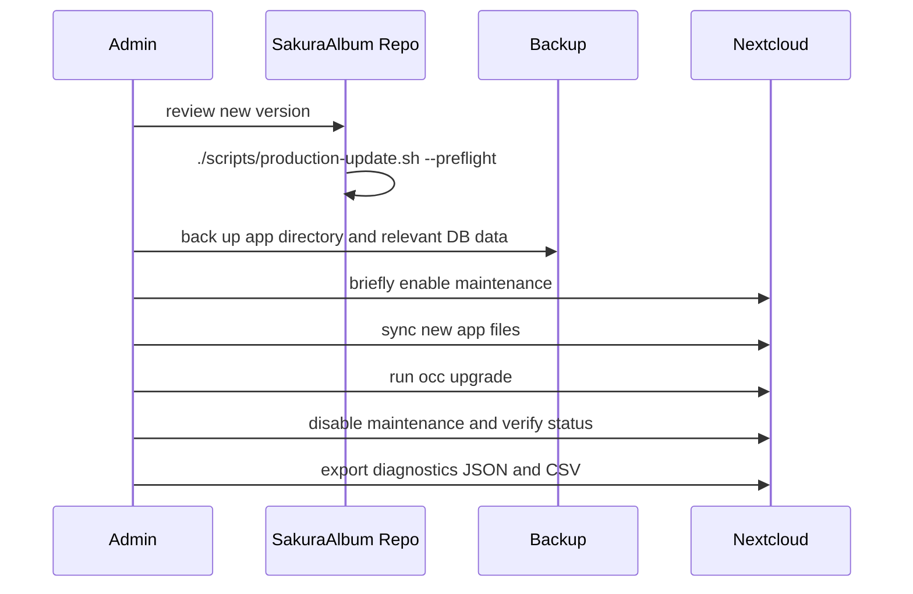

# SakuraAlbum

<p align="center">
  
</p>

<p align="center">
  <strong>Automatically maintained Nextcloud Photos albums from existing folders.</strong><br>
  SakuraAlbum turns real-world folder structures into safe, traceable, continuously updated Photos albums.
</p>

<p align="center">
  <a href="README.md">Deutsche Version</a>
</p>

<p align="center">
  
  
  
  
</p>

> **Preliminary license status:** SakuraAlbum is currently governed by the [Preliminary Development and Evaluation License](LICENSE.md). Commercial use, redistribution, and app-store distribution are not permitted without prior explicit written permission. Before a future Nextcloud App Store release, the project must be relicensed under AGPL-3.0-or-later or another compatible license and formally reviewed.

## The idea

Many Nextcloud installations contain years of photo folders: family pictures, travel archives, projects, pets, events, scans, and phone uploads. The files are already there, but Nextcloud Photos albums are still often curated manually.

SakuraAlbum bridges that gap. Users choose source folders, preview the resulting album structure, and let SakuraAlbum create or update managed Photos albums in the background. The file structure stays the source of truth; SakuraAlbum keeps the albums aligned.

## Why SakuraAlbum?

| Without SakuraAlbum | With SakuraAlbum |
| --- | --- |
| Albums are maintained manually. | Folder structures become managed Photos albums. |
| New, moved, renamed, or deleted files make albums stale. | File events queue safe background updates. |
| Large libraries can create too many albums. | Depth, folder rules, and single-album mode control the structure. |
| Cleanup is risky. | Deletion and reset actions are limited to albums clearly managed by SakuraAlbum. |
| Troubleshooting needs manual log digging. | Health diagnostics and CSV exports show operational issues directly. |

## Use cases

| Situation | SakuraAlbum solution |
| --- | --- |
| Family archive with year and event folders | `/Photos/Family/2026/Birthday` becomes traceable albums without moving files. |
| Years of phone uploads | Depth and folder rules keep album counts manageable. |
| Pet, hobby, or project folders | A whole subtree can be maintained as a single album. |
| Club or team photos | Admins control rollout, groups, quotas, and maintenance windows. |
| Large photo exports | Albums are prepared in the background and split into ZIP parts for very large exports. |
| Troubleshooting production servers | Debug logs, health findings, and CSV exports expose queue, Cron, cursor, and export issues. |

## Highlights

| Feature | Value |
| --- | --- |
| **Automatic album updates** | File changes queue work; heavy scans and Photos writes happen later under admin limits. |
| **Folder picker** | Users select source folders from their own Files area instead of typing raw paths. |
| **Folder-specific rules** | Subfolders can use custom depth, be excluded, or be collapsed into one album. |
| **Preview and dry-run** | Users can see planned albums and links before writes happen. |
| **Safe deletion** | SakuraAlbum deletes only albums it still tracks and re-validates against owner, name, and Photos album id. |
| **Large album downloads** | Managed and native Photos albums can be exported in the background; exports over 1 GiB are split into ZIP parts. |
| **Operational diagnostics** | Health checks detect stale locks, stuck runs, failed cursors, export failures, Cron issues, and recent warning/error logs. |
| **CSV diagnostics** | Users and admins can download diagnostic CSV files; SakuraAlbum also keeps a server-side AppData copy. |

## How it works



File events stay lightweight by design:



## Folder rules in practice



## Technical overview



## User experience

SakuraAlbum keeps the user-facing workflow simple:

- enable SakuraAlbum for the account,
- select one or more source folders,
- add optional folder rules,
- review the preview,
- let automation run,
- inspect progress, recent runs, and expandable details when needed.

Users do not need to understand Cron, database rows, or server paths. Large libraries are processed in the background and surfaced through status and progress views.

## Admin control

Admins control operational risk and server load:

- global enablement,
- optional group-limited rollout,
- default folders and exclusions,
- scan, file, album, event, and runtime limits,
- per-user managed album and media-link quotas,
- maintenance windows for automatic processing,
- debug logging and retention,
- health diagnostics and CSV exports.

That makes SakuraAlbum suitable for production Nextcloud servers where media libraries are large and background work must remain predictable.

## Safety model

SakuraAlbum is built defensively:

- write actions require a recent server-side dry-run fingerprint,
- destructive actions require exact confirmation text,
- foreign or renamed Photos albums are blocked instead of deleted,
- managed albums are tracked in SakuraAlbum-owned database tables,
- file events never write directly to Photos albums,
- background jobs do not run in parallel and respect admin limits,
- paths, diagnostic CSV files, logs, and background exports have hard server-side bounds,
- debug context is redacted before storage,
- diagnostic CSV exports remain available server-side for later analysis.

## Diagnostics that help development

SakuraAlbum 1.0.7 adds operational health diagnostics that evaluate common failure modes:

| Diagnostic area | Detects |
| --- | --- |
| Queue health | pending, failed, or overdue Auto-Sync queue rows |
| Lock health | stale processing locks after interrupted jobs |
| Run health | sync runs stuck in `running` |
| Cursor health | failed or stale chunk continuations |
| Export health | stale or failed album export jobs |
| Cron health | missing or stale Nextcloud Cron execution |
| Log health | warning and error logs from the last 24 hours |

CSV exports include health findings, queue samples, sync runs, and app logs. This makes controlled tests reproducible and gives developers the data needed to fix real operational problems.

## Album downloads

SakuraAlbum can prepare albums as ZIP files:

- direct ZIP downloads for managed albums within admin limits,
- background exports for SakuraAlbum-managed and native Photos albums,
- part ZIP files for exports above 1 GiB,
- separate admin limits for direct ZIP streams and background exports,
- `.nomedia` and `.noimage` markers in export folders so generated ZIPs are not scanned back into albums.

## Status

| Area | State |
| --- | --- |
| Current development version | `1.0.8` |
| Target platform | Nextcloud 33, PHP 8.3+ |
| License | Preliminary Development and Evaluation License, non-commercial |
| Store preparation | Technical metadata, docs, changelogs, checks, and release process are present; license is currently a store blocker |
| Production rule | Live updates require backup, preflight, and documented rollback |

SakuraAlbum is developed as a production-oriented Nextcloud app. New versions should still be rolled out only through controlled backup and update windows.

## Manual installation without the App Store

SakuraAlbum is not yet intended as a regular Nextcloud App Store app. Manual installation should only happen on a system with a backup and rollback plan.

1. Build or provide the package:

```bash
./scripts/build-artifact.sh
```

2. Extract it on the Nextcloud server so the directory is exactly named `sakuraalbum`:

```bash
sudo mkdir -p /var/www/nextcloud/apps/sakuraalbum
sudo tar -xzf /path/to/sakuraalbum-1.0.7.tar.gz -C /var/www/nextcloud/apps
sudo chown -R www-data:www-data /var/www/nextcloud/apps/sakuraalbum
```

3. Enable the app and verify Nextcloud:

```bash
sudo -u www-data php /var/www/nextcloud/occ app:enable sakuraalbum
sudo -u www-data php /var/www/nextcloud/occ upgrade
sudo -u www-data php /var/www/nextcloud/occ status
```

4. Then open SakuraAlbum in the admin settings:

- enable `Global aktiv` only after a backup test window,
- enable debug logging for tests,
- use small limits and a test group where possible,
- test first with `albentest` and isolated folders.

## Installing updates

Recommended update flow:



From the working tree:

```bash
./scripts/production-update.sh --preflight
SAKURAALBUM_PRODUCTION_UPDATE=1 ./scripts/production-update.sh --deploy
```

The deploy script is intentionally guarded. It creates a backup of the live app directory before copying and prints a restore prompt. If something fails: copy the app backup back, reset ownership to `www-data:www-data`, verify `occ status`, and use the previous database backup if migrations were involved.

## Installation and checks

Run local checks from the app directory:

```bash
./scripts/self-check.sh
```

Build a package:

```bash
./scripts/build-artifact.sh
```

Run the production preflight before every live update:

```bash
./scripts/production-update.sh --preflight
```

Deploy is intentionally guarded:

```bash
SAKURAALBUM_PRODUCTION_UPDATE=1 ./scripts/production-update.sh --deploy
```

Safe OCC helpers for controlled test windows:

```bash
php occ sakuraalbum:preview --user albentest
php occ sakuraalbum:sync --user albentest --dry-run
php occ sakuraalbum:delete-generated --user albentest --dry-run --all
```

## Documentation

- [User guide](docs/USER_GUIDE.md)
- [Admin guide](docs/ADMIN_GUIDE.md)
- [Developer notes](docs/DEVELOPER_NOTES.md)
- [Privacy](docs/PRIVACY.md)
- [Security model](docs/SECURITY_MODEL.md)
- [Update policy](docs/UPDATE_POLICY.md)
- [Test and UX backlog](docs/TEST_BACKLOG.md)
- [Store release checklist](docs/STORE_RELEASE_CHECKLIST.md)
- [Changelog](CHANGELOG.en.md)
- [German README](README.md)

## Roadmap

- Optional email delivery for diagnostic reports.
- Store submission after a fresh review of current Nextcloud and Photos APIs and a formal relicense to a store-compatible license.
- Wider Nextcloud version support after targeted tests.
- UI screenshots and short demo graphics once the final production UI is stable on the target system.

## Project identity

SakuraAlbum is quiet automation instead of blunt mass operations: a cherry blossom falls onto a dog while large photo archives are organized in the background without overwhelming the server.
