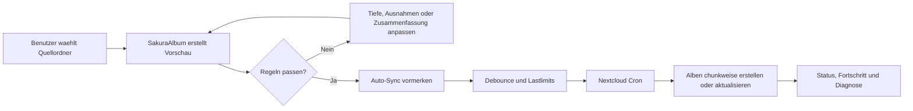
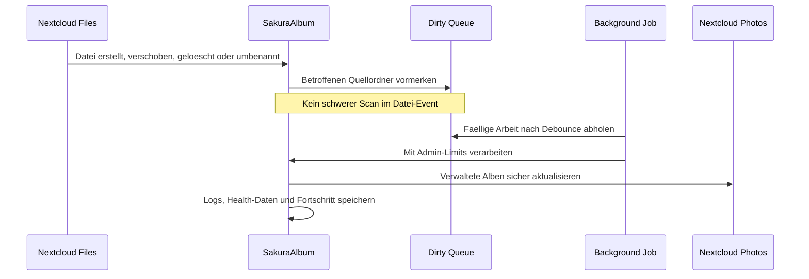
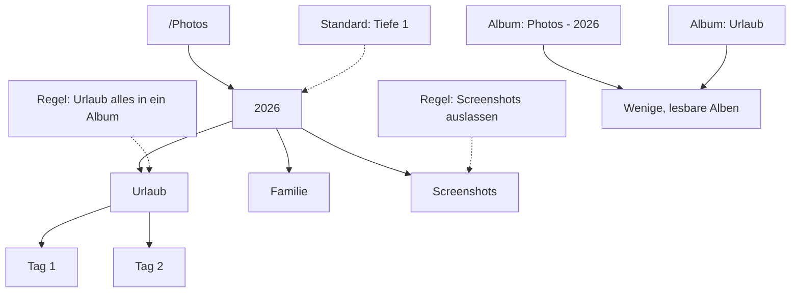
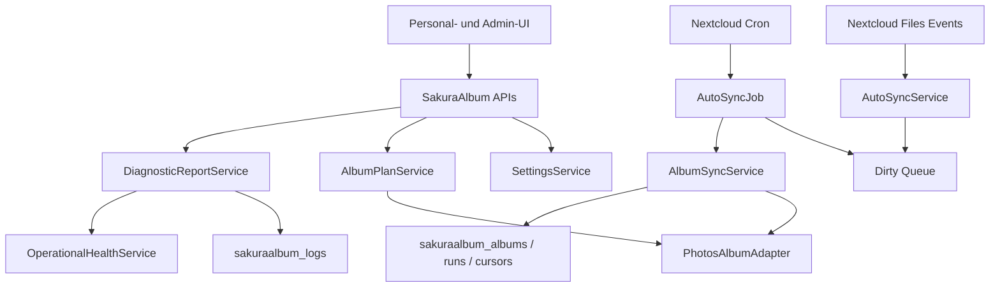
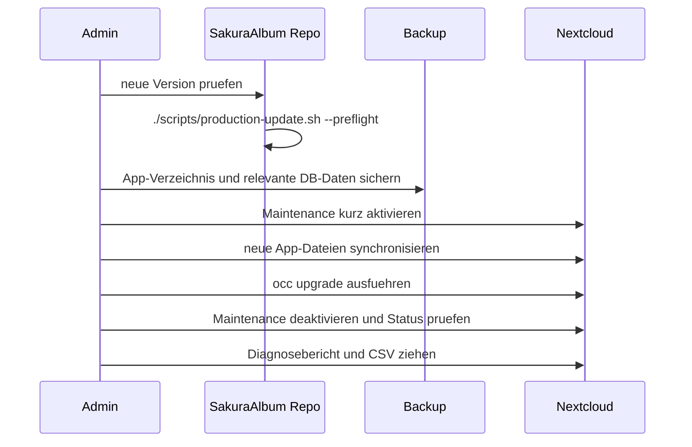

# SakuraAlbum

<p align="center">
  
</p>

<p align="center">
  <strong>Automatisch gepflegte Nextcloud Photos-Alben aus bestehenden Ordnern.</strong><br>
  SakuraAlbum verwandelt gewachsene Fotoordner in sichere, nachvollziehbare und laufend aktualisierte Alben.
</p>

<p align="center">
  <a href="README.en.md">English version</a>
</p>

<p align="center">
  
  
  
  
</p>

> **Vorlaeufiger Lizenzstatus:** SakuraAlbum steht aktuell unter der [Vorlaeufigen Entwicklungs- und Evaluierungslizenz](LICENSE.md). Kommerzielle Nutzung, Weiterverbreitung und App-Store-Verteilung sind ohne ausdrueckliche schriftliche Erlaubnis nicht erlaubt. 

## Die Idee

Viele Nextcloud-Installationen enthalten ueber Jahre gewachsene Fotoordner: Familienfotos, Reisen, Projekte, Haustiere, Veranstaltungen, Scans und Handy-Uploads. In Nextcloud Photos sind diese Dateien zwar vorhanden, aber nicht automatisch als sinnvolle Alben gepflegt.

SakuraAlbum schliesst diese Luecke. Die App liest ausgewaehlte Quellordner, plant daraus Photos-Alben, zeigt vorab eine klare Vorschau und erstellt oder aktualisiert die Alben kontrolliert im Hintergrund. Der Benutzer arbeitet weiter mit seinen Dateien; SakuraAlbum sorgt dafuer, dass die Alben dazu passen.

## Warum SakuraAlbum?

| Ohne SakuraAlbum | Mit SakuraAlbum |
| --- | --- |
| Alben muessen manuell gepflegt werden. | Ordnerstrukturen werden automatisch zu Photos-Alben. |
| Neue, verschobene oder geloeschte Bilder machen Alben schnell inkonsistent. | Datei-Events merken Updates vor; Cron verarbeitet sie serverfreundlich. |
| Grosse Sammlungen erzeugen schnell zu viele Alben. | Tiefe, Ordnerregeln und "alles in ein Album" steuern die Struktur. |
| Aufraeumen ist riskant. | Loesch- und Reset-Funktionen arbeiten nur auf eindeutig verwalteten SakuraAlbum-Alben. |
| Fehleranalyse ist muehsam. | Diagnoseberichte, Health Checks und CSV-Logs zeigen, was wirklich passiert. |

## Use Cases

| Situation | SakuraAlbum-Loesung |
| --- | --- |
| Familienarchiv mit Jahres- und Ereignisordnern | `/Photos/Familie/2026/Geburtstag` wird automatisch zu nachvollziehbaren Alben, ohne Dateien umzuraeumen. |
| Handy-Uploads mehrerer Jahre | Hohe Albumzahl wird durch Tiefe und Ordnerregeln begrenzt. |
| Haustier-, Hobby- oder Projektordner | Ein kompletter Unterordner kann als ein einziges Album gepflegt werden. |
| Vereins- oder Teamfotos | Admins koennen Rollout, Gruppen, Quoten und Wartungsfenster kontrollieren. |
| Grosse Fotoexporte | Alben werden im Hintergrund als ZIP vorbereitet und bei sehr grossen Datenmengen in Teile aufgeteilt. |
| Fehlersuche auf produktiven Servern | Debug-Logs, Health-Befunde und CSV-Exports zeigen Queue-, Cron-, Cursor- und Exportprobleme. |

## Highlights

| Funktion | Nutzen |
| --- | --- |
| **Automatische Albumaktualisierung** | Neue, geaenderte, verschobene, umbenannte oder geloeschte Dateien loesen keinen schweren Sofort-Scan aus, sondern werden sicher fuer den Hintergrund vorgemerkt. |
| **Quellordner per Auswahlmenue** | Benutzer waehlen Ordner aus ihrer Nextcloud-Dateistruktur statt rohe Pfade einzutippen. |
| **Ordnerregeln** | Einzelne Unterordner koennen eine eigene Tiefe bekommen, komplett ausgelassen oder zu einem einzigen Album zusammengefasst werden. |
| **Vorschau und Dry-Run** | Vor Schreibaktionen sieht der Benutzer, welche Alben und Links entstehen wuerden. |
| **Sichere Loeschung** | SakuraAlbum loescht nur Alben, die es eindeutig selbst verwaltet und erneut gegen Besitzer, Name und Photos-ID geprueft hat. |
| **Grosse Album-Downloads** | SakuraAlbum- und native Photos-Alben koennen als Hintergrund-Export vorbereitet werden; ab 1 GiB werden ZIP-Teile erzeugt. |
| **Betriebsdiagnose** | Health Checks finden stale Locks, haengende Runs, fehlerhafte Cursor, Exportfehler, Cron-Probleme und aktuelle Warn-/Fehlerlogs. |
| **CSV-Fehlerlogs** | Admins und Benutzer koennen Diagnose-CSV herunterladen; eine Kopie bleibt serverseitig im SakuraAlbum-AppData erhalten. |

## So funktioniert es



Datei-Events werden bewusst leichtgewichtig behandelt:



## Strukturregeln in der Praxis



## Technischer Ueberblick



## Benutzererlebnis

SakuraAlbum ist fuer normale Benutzer einfach gehalten:

- App fuer das eigene Konto aktivieren.
- Einen oder mehrere Quellordner auswaehlen.
- Bei Bedarf Unterordner-Regeln setzen.
- Vorschau ansehen.
- Automatik laufen lassen.
- Fortschritt, letzte Laeufe und Details bei Bedarf aufklappen.

Der Benutzer muss keine Cronjobs, Pfade oder Datenbankdetails verstehen. Wenn viele Bilder verarbeitet werden, zeigt SakuraAlbum Status und Fortschritt statt den Browser zu blockieren.

## Admin-Kontrolle

Admins behalten die Kontrolle ueber Ressourcen und Risiko:

- globale Freigabe,
- optionaler Rollout nur fuer bestimmte Nextcloud-Gruppen,
- Standard-Quellordner und Standard-Ausnahmen,
- Scan-, Datei-, Album- und Laufzeitlimits,
- Benutzerquoten fuer verwaltete Alben und Medienlinks,
- Wartungsfenster fuer automatische Verarbeitung,
- Debug-Logging und Log-Aufbewahrung,
- Health-Diagnose und CSV-Export.

Damit eignet sich SakuraAlbum auch fuer produktive Server, auf denen Foto-Sammlungen gross sind und Hintergrundarbeit planbar bleiben muss.

## Sicherheit und Nachvollziehbarkeit

SakuraAlbum ist defensiv gebaut:

- Schreibaktionen benoetigen serverseitig gespeicherte Dry-Run-Fingerprints.
- Direkte Loeschungen verlangen exakte Bestaetigungen.
- Fremde oder umbenannte Photos-Alben werden blockiert statt geloescht.
- Verwaltete Alben werden in SakuraAlbum-eigenen Tabellen verfolgt.
- Datei-Events schreiben nie direkt in Photos-Alben.
- Hintergrundjobs laufen nicht parallel und respektieren Admin-Limits.
- Pfade, Diagnose-CSV-Dateien, Logs und Hintergrund-Exports haben harte serverseitige Grenzen.
- Debug-Kontexte werden vor dem Speichern redigiert.
- Diagnose-CSV bleibt serverseitig verfuegbar, damit Tests spaeter nachvollziehbar bleiben.

## Diagnose, die beim Entwickeln wirklich hilft

SakuraAlbum 1.0.7 fuehrt Betriebsdiagnosen ein, die nicht nur Logs anzeigen, sondern typische Stoerungen aktiv bewerten:

| Diagnose | Erkennt |
| --- | --- |
| Queue Health | wartende, fehlgeschlagene oder ueberfaellige Auto-Sync-Eintraege |
| Lock Health | haengende Processing-Locks nach abgebrochenen Jobs |
| Run Health | Sync-Laeufe, die zu lange auf `running` stehen |
| Cursor Health | fehlgeschlagene oder stale Chunk-Fortsetzungen |
| Export Health | haengende oder fehlgeschlagene Album-Exportjobs |
| Cron Health | fehlende oder zu alte Nextcloud-Cron-Ausfuehrung |
| Log Health | Warnungen und Fehler aus den letzten 24 Stunden |

CSV-Exports enthalten Health-Befunde, Queue-Samples, Sync-Runs und App-Logs. Das macht kontrollierte Tests reproduzierbarer und spart Zeit bei Fehleranalysen.

## Album-Downloads

SakuraAlbum kann Alben als ZIP vorbereiten:

- einzelne verwaltete Alben direkt, solange Admin-Limits eingehalten werden,
- SakuraAlbum-verwaltete Alben und native Photos-Alben als Hintergrundjob,
- grosse Exporte mit Teil-ZIP-Dateien ab 1 GiB,
- separate Admin-Limits fuer direkte ZIP-Streams und Hintergrund-Exports,
- Exportordner mit `.nomedia` und `.noimage`, damit erzeugte ZIPs nicht wieder in Album-Scans landen.

## Status

| Bereich | Stand |
| --- | --- |
| Aktuelle Entwicklungsversion | `1.0.13` |
| Zielplattform | Nextcloud 33, PHP 8.3+ |
| Lizenz | Vorlaeufige Entwicklungs- und Evaluierungslizenz, nichtkommerziell |
| Store-Vorbereitung | Technische Metadaten, Docs, Changelogs, Checks und Release-Prozess vorhanden; Lizenz ist aktuell ein Store-Blocker |
| Produktionsregel | Live-Updates nur mit Backup, Preflight und dokumentiertem Rollback |

SakuraAlbum wird als produktiv nutzbare Nextcloud-App entwickelt. Trotzdem gilt: neue Versionen sollten erst nach kontrolliertem Backup-/Updatefenster auf produktiven Servern aktiviert werden.

## Manuelle Installation ohne App Store

SakuraAlbum ist noch nicht als regulaere Nextcloud-App-Store-App gedacht. Eine manuelle Installation sollte nur auf einem System erfolgen, fuer das ein Backup und ein Rollback-Plan existieren.

1. Paket bauen oder bereitstellen:

```bash
./scripts/build-artifact.sh
```

2. Auf dem Nextcloud-Server entpacken, sodass der Ordner exakt `sakuraalbum` heisst:

```bash
sudo mkdir -p /var/www/nextcloud/apps/sakuraalbum
sudo tar -xzf /pfad/zu/sakuraalbum-1.0.7.tar.gz -C /var/www/nextcloud/apps
sudo chown -R www-data:www-data /var/www/nextcloud/apps/sakuraalbum
```

3. App aktivieren und Nextcloud pruefen:

```bash
sudo -u www-data php /var/www/nextcloud/occ app:enable sakuraalbum
sudo -u www-data php /var/www/nextcloud/occ upgrade
sudo -u www-data php /var/www/nextcloud/occ status
```

4. Danach im Adminbereich SakuraAlbum oeffnen:

- `Global aktiv` erst nach Backup-Testfenster einschalten.
- `Debug-Logging` fuer Tests aktivieren.
- Kleine Limits und ggf. eine Testgruppe verwenden.
- Zuerst nur mit `albentest` und isolierten Testordnern pruefen.

## Updates installieren

Empfohlener Ablauf fuer Updates:



Praktisch im Arbeitsverzeichnis:

```bash
./scripts/production-update.sh --preflight
SAKURAALBUM_PRODUCTION_UPDATE=1 ./scripts/production-update.sh --deploy
```

Das Deploy-Skript ist absichtlich gesichert. Es erstellt vor dem Kopieren ein Backup des Live-App-Verzeichnisses und gibt einen Wiederherstellungsprompt aus. Bei Problemen: App-Backup zurueckkopieren, Eigentuemer auf `www-data:www-data` setzen, `occ status` pruefen und bei Datenbankmigrationen das vorherige DB-Backup verwenden.

## Installation und Tests

Lokale Pruefung im App-Verzeichnis:

```bash
./scripts/self-check.sh
```

Paket bauen:

```bash
./scripts/build-artifact.sh
```

Produktions-Preflight vor jedem Live-Update:

```bash
./scripts/production-update.sh --preflight
```

Bewusst geschuetzter Deploy:

```bash
SAKURAALBUM_PRODUCTION_UPDATE=1 ./scripts/production-update.sh --deploy
```

OCC-Helfer fuer kontrollierte Testfenster:

```bash
php occ sakuraalbum:preview --user albentest
php occ sakuraalbum:sync --user albentest --dry-run
php occ sakuraalbum:delete-generated --user albentest --dry-run --all
```

## Dokumentation

- [Benutzerhandbuch](docs/USER_GUIDE.md)
- [Admin-Handbuch](docs/ADMIN_GUIDE.md)
- [Entwicklernotizen](docs/DEVELOPER_NOTES.md)
- [Datenschutz](docs/PRIVACY.md)
- [Sicherheitsmodell](docs/SECURITY_MODEL.md)
- [Update-Policy](docs/UPDATE_POLICY.md)
- [Test- und UX-Backlog](docs/TEST_BACKLOG.md)
- [Store-Release-Checkliste](docs/STORE_RELEASE_CHECKLIST.md)
- [Changelog](CHANGELOG.md)
- [English version](README.en.md)

## Roadmap

- Diagnoseberichte optional per Mail versenden.
- Store-Einreichung nach erneuter Pruefung der aktuellen Nextcloud-/Photos-APIs und nach formaler Relizenzierung auf eine store-kompatible Lizenz.
- Kompatibilitaet fuer weitere Nextcloud-Versionen nach gezielten Tests erweitern.
- UI-Screenshots und kurze Demo-Grafiken ergaenzen, sobald das finale Design auf dem Zielsystem stabil ist.

## Projektidentitaet

SakuraAlbum steht fuer leise Automatisierung statt harter Massenoperationen: eine Kirschbluete faellt auf einen Hund, und im Hintergrund werden grosse Fotoarchive geordnet, ohne den Server aus dem Tritt zu bringen.
